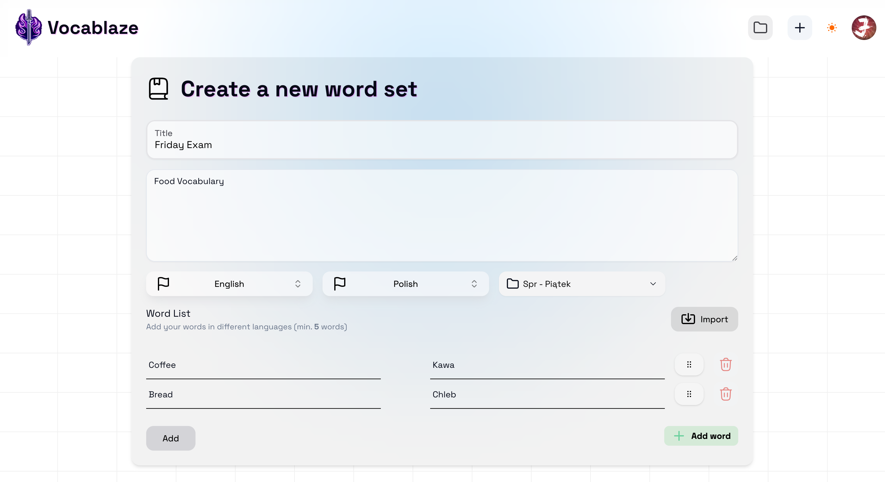

# Vocablaze - Language Learning Platform

#
Whole documentation of this codebase available at: [https://deepwiki.com/szymon-grzesiak/vocablaze](https://deepwiki.com/szymon-grzesiak/vocablaze)
#

Vocablaze is an interactive web platform designed to facilitate foreign language learning through personalized vocabulary sets, engaging games, and progress tracking.

## 🚀 Overview

The objective of the Vocablaze project is to create a web platform for language learning that allows users to create personalized sets of vocabulary with translations, learn using the flashcard method, solve quizzes, and engage with language games. Users will also be able to track their progress and customize the app's appearance.

## 🎯 Problem

Current technologies offer countless possibilities to facilitate learning and acquiring new skills. The proposed language vocabulary learning platform meets the needs of individuals seeking modern educational methods. Unlike other available solutions such as Duolingo and Anki, this platform focuses on interactive vocabulary learning through flashcards, quizzes, and language games (e.g., Hangman), while also allowing users to share materials with others.

* **Compared to Duolingo:** Vocablaze offers greater content personalization and direct involvement in creating educational material, rather than guiding the user through a predefined series of lessons.
* **Compared to Anki:** While Anki is an excellent tool for spaced repetition and efficient memorization, Vocablaze offers a wider range of interactive learning forms.

## ✨ Features

Here's a breakdown of key functionalities:

* **📚 Custom Vocabulary Sets:** Users can create and manage their own vocabulary lists with translations.
    

* **🎲 Language Games:** Engage with interactive games designed to make learning fun and effective.
    * **Flashcards:** Classic method for learning and reviewing vocabulary.
        
    * **Matching Tiles:** Interactive game involving matching words with their translations.
        
    * **Hangman:** Popular word game to help reinforce spelling.
        

* **📊 Progress Tracking:** Detailed statistics and visualizations to monitor learning progress.
    

* **🎨 Customizable Appearance:** Personalize the platform's interface to match user preferences.
    Light/dark mode toggle and custom color themes.
* **🔄 Material Sharing:** Easily share created vocabulary sets with other users.

* **📄 Import Words from Files:** Conveniently import vocabulary lists from external files (e.g., CSV, TXT).

* **🔐 Google/GitHub Authentication:** Quick and secure login using social accounts.

* **🌟 Premium Features (Paid):** Unlock additional benefits with a premium subscription.
    * Enhanced game options.
    * Advanced progress analytics.
    * Secure payment processing via Stripe.

* **🔑 Advanced Authentication:**
    * Password reset via email (using Resend).
    * Two-Factor Authentication (2FA).
    * OAuth login (Google).

## 🛠️ Tech Stack

The platform is built using modern technologies to ensure performance, scalability, and an excellent user experience.

* **Framework:** Next.js 14
* **Language:** TypeScript
* **Styling:** Tailwind CSS, NextUI, Radix UI, Framer Motion, clsx, tailwind-merge
* **Database & ORM:** Prisma
* **Authentication:** NextAuth.js (with Prisma adapter), bcryptjs, jose
* **Payments:** Stripe, @stripe/stripe-js
* **Forms & Validation:** React Hook Form, Zod
* **API & Communication:** Resend (for emails)
* **State & UI:** React, React DOM
* **Developer Tools:** ESLint, Prettier, Jest, Cypress, tsx
* **UI Components & Utilities:**
    * `@dnd-kit/*`: Drag and drop
    * `lucide-react`: Icons
    * `recharts`: Charts
    * `sonner`: Notifications (toasts)
    * `cmdk`: Command palette
    * `canvas-confetti`: Visual effects
    * `date-fns`: Date operations
    * `file-saver`: File saving
* **Deployment:** Vercel

## 💡 Key Learnings & Achievements

Working solo on this project provided comprehensive experience across the full development lifecycle:

* **Full Authentication and Authorization:** Mastered the implementation of full authentication and authorization workflows, including advanced features like password reset via email and two-factor authentication, using industry-standard protocols (NextAuth.js) and services like Resend.
* **Stripe Payment Integration:** Gained significant experience with Stripe, learning how to securely manage payment processing, including handling premium features and ensuring compliance with security standards.
* **Backend Development:** Improved backend development skills, particularly in optimizing database queries (Prisma) and managing server-side logic, to ensure the platform's performance and scalability.
* **Advanced Next.js Usage:** Developed a strong understanding of Next.js, mastering its server-side rendering (SSR), static site generation (SSG), and API route handling, all of which were crucial to the project's success.
* **Solo Project Management:** Efficiently managed time and rapidly learned and applied new technologies under tight deadlines while handling all aspects of development independently.

## 📄 License

Copyright (c) 2025 Szymon Grzesiak. All Rights Reserved.

Please refer to the `LICENSE` file in the root directory of this source tree for the full terms and conditions regarding the use of this software.
---

Made with ❤️ by Szymon Grzesiak
